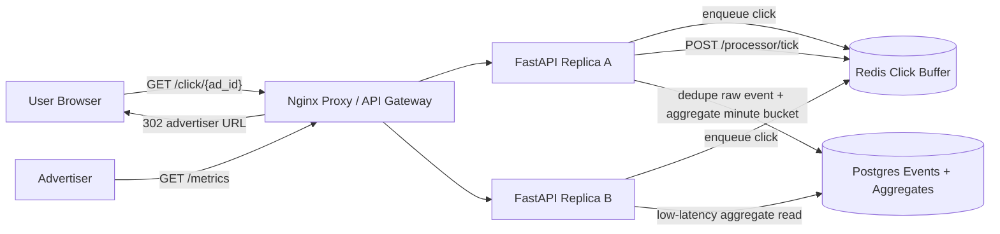

# Ad Click Aggregator

Small Docker Compose prototype for an ad click aggregation system.

- Nginx reverse proxy as the local load balancer/API gateway analogue
- Two stateless FastAPI replicas
- Redis click-event buffer for write spike absorption
- Postgres raw click event store and minute-level aggregate table
- Idempotent click tracking by `click_id`
- Server-side `302` redirect after enqueueing the click

Source: <https://www.hellointerview.com/learn/system-design/problem-breakdowns/ad-click-aggregator>

## Run

```bash
docker compose up --build
```

API docs: <http://localhost:8050/docs>

Runtime data is intentionally ephemeral. Postgres uses tmpfs and Redis persistence is disabled, so `docker compose down` wipes local click data.

## Diagram



## API

Track and redirect a click:

```bash
curl -i 'http://localhost:8050/click/ad-1?click_id=click-1&user_id=alice'
```

Process buffered events:

```bash
curl -s -X POST 'http://localhost:8050/processor/tick?limit=100'
```

Query advertiser metrics:

```bash
curl -s 'http://localhost:8050/metrics?ad_id=ad-1'
```

## Try It

```bash
python scripts/smoke_test.py
```

Run unit tests inside an API replica:

```bash
docker compose exec -T api-a python -m pytest -q
```

## Design Notes

The prototype separates click capture from aggregation. The user-facing click path only validates the ad, enqueues an event, and redirects. A processor drains the buffer, writes idempotent raw events, and updates pre-aggregated minute buckets so advertiser queries stay fast.
