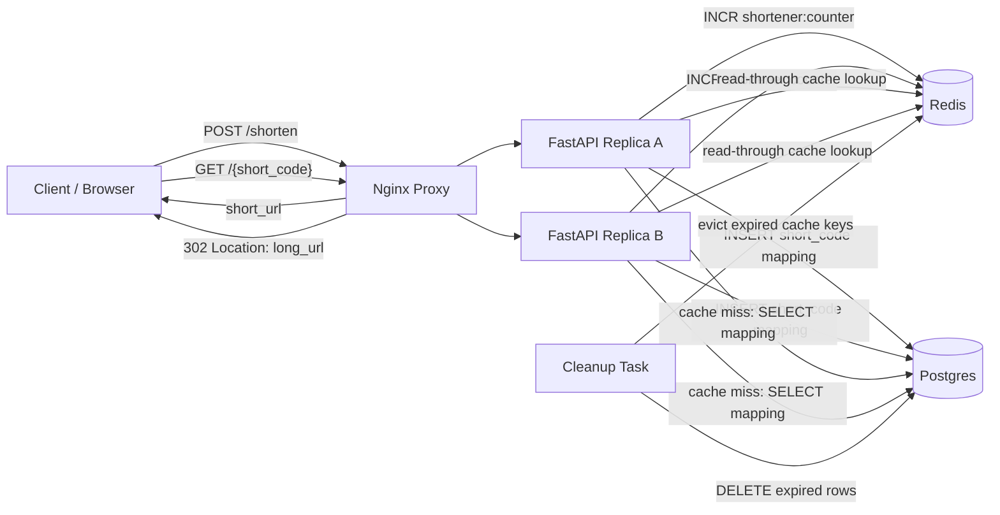

# Bitly URL Shortener

Small Docker Compose prototype for the Bitly-style design:

- FastAPI primary server
- Nginx reverse proxy in front of two FastAPI replicas
- Postgres mapping store with `short_code` primary-key uniqueness
- Redis atomic counter for generated codes
- Redis read-through cache for redirects
- Background cleanup task for expired URLs
- `302` redirects, `404` missing codes, and `410` expired codes

## Run

```bash
docker compose up --build
```

API docs: <http://localhost:8000/docs>

Manual UI: <http://localhost:8000/>

Runtime data is intentionally ephemeral. Postgres uses tmpfs and Redis persistence is disabled, so `docker compose down` wipes local state.

## Diagram



## API

`POST /shorten`

```json
{
  "long_url": "https://example.com/a/long/path",
  "custom_alias": "optional-alias",
  "expiration_date": "2030-01-01T00:00:00Z"
}
```

Returns:

```json
{
  "short_url": "http://localhost:8000/gLf4K",
  "short_code": "gLf4K",
  "expires_at": null
}
```

`GET /{short_code}`

Returns:

- `302 Found` with `Location: <long_url>` when active
- `404 Not Found` when the code does not exist
- `410 Gone` when the code exists but is expired

## Try It

Create a generated short URL:

```bash
curl -s -X POST http://localhost:8000/shorten \
  -H 'content-type: application/json' \
  -d '{"long_url":"https://www.hellointerview.com/learn/system-design/problem-breakdowns/bitly"}'
```

Create a custom alias:

```bash
curl -s -X POST http://localhost:8000/shorten \
  -H 'content-type: application/json' \
  -d '{"long_url":"https://example.com","custom_alias":"my-alias"}'
```

Inspect redirect without following it:

```bash
curl -i http://localhost:8000/my-alias
```

Run the functional smoke test:

```bash
python scripts/smoke_test.py
```

Run unit tests inside the API container:

```bash
docker compose exec -T api-a python -m pytest -q
```

Create an expiring URL:

```bash
curl -s -X POST http://localhost:8000/shorten \
  -H 'content-type: application/json' \
  -d '{"long_url":"https://example.com","custom_alias":"expires-soon","expiration_date":"2030-01-01T00:00:00Z"}'
```

## Design Notes

Generated codes use Redis `INCR`, XOR obfuscation, and base62 encoding with a reserved `g` prefix. Custom aliases are kept out of that namespace, which avoids alias collisions with generated codes. Redirects read Redis first, then Postgres, and cache database misses only by omission so newly-created links are immediately visible.

Source: <https://www.hellointerview.com/learn/system-design/problem-breakdowns/bitly>
