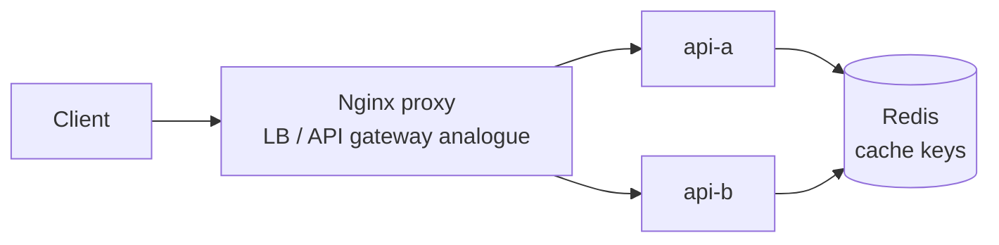

# Distributed Cache Working Example

Reference: [Hello Interview Distributed Cache](https://www.hellointerview.com/learn/system-design/problem-breakdowns/distributed-cache)

This prototype demonstrates cache key routing, TTL writes, reads, deletes, and miss behavior. Redis is the backing store and the app exposes the selected owner node for each key so the distribution logic is visible.

## Stack

- Python, FastAPI
- Nginx proxy on `http://localhost:8240`
- Redis for ephemeral cache storage
- Docker Compose with two API replicas: `api-a` and `api-b`

Redis persistence is disabled, so `docker compose down` wipes data.

## Run

```bash
docker compose up --build
```

Manual UI: `http://localhost:8240`

## Diagram



## API

```bash
curl -s http://localhost:8240/ring/user:1
curl -s -X PUT http://localhost:8240/cache/user:1 -H 'content-type: application/json' -d '{"value":"cached profile","ttlSeconds":60}'
curl -s http://localhost:8240/cache/user:1
curl -s -X DELETE http://localhost:8240/cache/user:1
```

## Tests

```bash
make distributed-cache-test
```

The smoke test verifies UI loading, load balancing, owner lookup, set/get/delete behavior, TTL metadata, and cache misses.

## Design Notes

- `owner_for_key` is a small deterministic routing helper that stands in for consistent hashing in the local demo.
- Redis stores values under owner-qualified keys, making the sharding decision visible without running multiple Redis nodes.
- TTL support models cache expiry and allows `docker compose down` to remain fully disposable.
