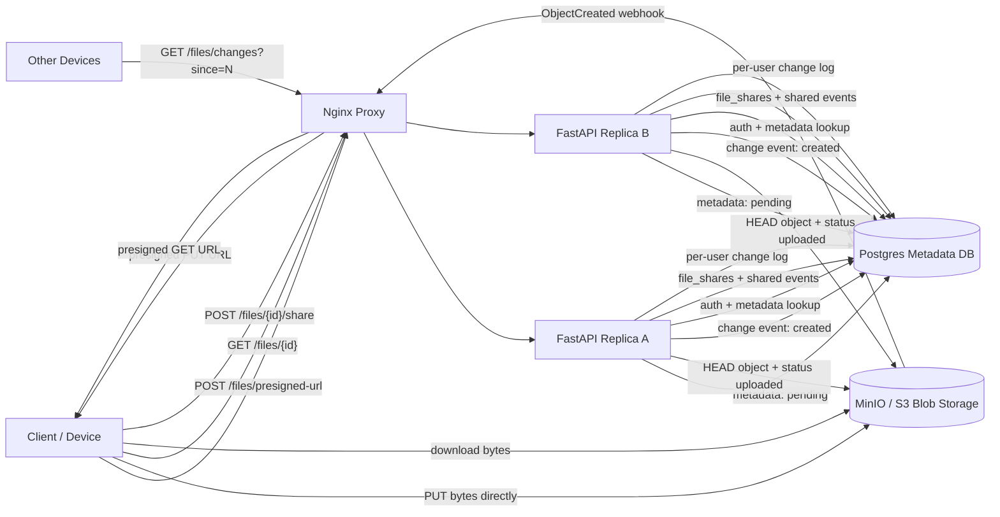

# Dropbox File Sync

Small Docker Compose prototype for a Dropbox-style file storage service:

- FastAPI file service
- Nginx reverse proxy in front of two FastAPI replicas
- Postgres metadata, share, chunk, and change-event tables
- MinIO as local S3-compatible blob storage
- Presigned URLs so file bytes go directly between client and blob storage
- MinIO bucket notifications that call the API asynchronously before metadata is marked uploaded
- Download URLs that model CDN-backed presigned downloads
- Share table optimized for "files shared with this user"
- Sync polling through a per-user change log
- Multipart upload state for resumable large-file uploads

## Run

```bash
docker compose up --build
```

API docs: <http://localhost:8010/docs>

Manual UI: <http://localhost:8010/>

MinIO console: <http://localhost:9002>

Runtime data is intentionally ephemeral. Postgres and MinIO use tmpfs-backed data paths, so `docker compose down` wipes local metadata and files.

Credentials:

```text
minioadmin / minioadmin
```

## Diagram



## API

All endpoints require `X-User-Id`.

Create a presigned upload:

```http
POST /files/presigned-url
```

```json
{
  "file_metadata": {
    "name": "notes.txt",
    "size": 1234,
    "mime_type": "text/plain",
    "fingerprint": "optional-client-hash"
  }
}
```

The server stores metadata as `pending` and returns a presigned `PUT` URL. After the client uploads bytes to MinIO, the client does not call the API again. MinIO sends an object-created webhook to the API through the internal Nginx proxy:

```http
POST /storage/events/minio
```

The backend does not trust the webhook blindly. It decodes the MinIO event payload, looks up file metadata by object key, calls `HeadObject`, verifies the uploaded object size, and only then marks the file `uploaded` and writes the owner's sync change event.

`POST /files/{file_id}/complete` still exists as a client hint for local experimentation, but it uses the same object-store verification path and is not authoritative by itself. The normal demo path is fully asynchronous: upload bytes, then poll `GET /files/{file_id}` until it becomes available.

Download metadata and a presigned download URL:

```http
GET /files/{file_id}
```

Share with users:

```http
POST /files/{file_id}/share
```

```json
{
  "users": ["bob", "carol"]
}
```

Poll for remote changes:

```http
GET /files/changes?since=0
```

## Large File Flow

Create a multipart upload:

```http
POST /files/multipart/presigned-url
```

```json
{
  "file_metadata": {
    "name": "video.mov",
    "size": 53687091200,
    "mime_type": "video/quicktime",
    "fingerprint": "whole-file-hash"
  },
  "chunk_size": 8388608
}
```

The response contains one presigned upload URL per part. After each part upload, save the returned `ETag`:

```http
PATCH /files/{file_id}/parts/{part_number}
```

```json
{
  "etag": "etag-from-s3"
}
```

Resume by checking part status:

```http
GET /files/{file_id}/parts
```

Complete after all parts are uploaded:

```http
POST /files/{file_id}/complete-multipart
```

For multipart uploads, S3 emits `ObjectCreated:CompleteMultipartUpload` after the backend completes the multipart upload. The demo endpoint immediately verifies the completed object with `HeadObject` and applies the same uploaded transition.

## Try It

```bash
python scripts/smoke_test.py
```

Run unit tests inside the API container:

```bash
docker compose exec -T api-a python -m pytest -q
```

## Design Notes

This prototype follows the Hello Interview Dropbox design: store metadata separately from file bytes, use presigned URLs to avoid routing large files through the app server, keep shares in a separate table, and model device sync with change events.

Upload completion is intentionally storage-confirmed. Clients can report progress, but the backend marks a file uploaded only after object storage can prove the object exists and matches the metadata.

The Compose stack configures MinIO notifications with:

```text
MINIO_NOTIFY_WEBHOOK_ENABLE_dropbox=on
MINIO_NOTIFY_WEBHOOK_ENDPOINT_dropbox=http://proxy/storage/events/minio
```

and a one-shot `minio-events` setup container runs:

```bash
mc event add local/dropbox-files arn:minio:sqs::dropbox:webhook --event put
```

Source: <https://www.hellointerview.com/learn/system-design/problem-breakdowns/dropbox>
