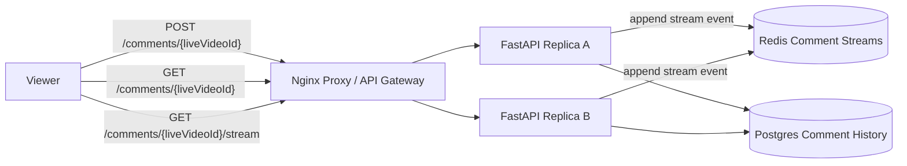

# FB Live Comments

Small Docker Compose prototype for a Facebook Live-style comments service.

- Nginx reverse proxy as the local load balancer/API gateway analogue
- Two stateless FastAPI replicas
- Postgres durable comment history with cursor pagination
- Redis stream per live video for near-real-time polling
- Manual UI for posting comments, loading history, and polling stream updates

Source: <https://www.hellointerview.com/learn/system-design/problem-breakdowns/fb-live-comments>

## Run

```bash
docker compose up --build
```

API docs: <http://localhost:8170/docs>

Manual UI: <http://localhost:8170/>

Runtime data is intentionally ephemeral. Postgres uses tmpfs and Redis persistence is disabled, so `docker compose down` wipes local comment data.

## Diagram



## API Examples

Post and read comments:

```bash
curl -s -X POST http://localhost:8170/comments/live-1 \
  -H 'content-type: application/json' \
  -H 'X-User-Id: alice' \
  -d '{"message":"great live video"}'

curl -s 'http://localhost:8170/comments/live-1?page_size=10'
curl -s 'http://localhost:8170/comments/live-1/stream?after=0-0'
```

## Tests

Run unit tests inside an API replica:

```bash
docker compose up --build -d
docker compose exec -T api-a python -m pytest -q
```

Run the smoke test through the proxy:

```bash
python scripts/smoke_test.py
```

Or from the repo root:

```bash
make fb-live-comments-test
```

## Design Notes

- Comment history uses cursor pagination rather than offset pagination so new comments do not shift pages while viewers scroll.
- New comments are also appended to a Redis stream. In a production system, WebSocket servers could consume this stream or Redis pub/sub to push updates to connected viewers.
- Availability is prioritized over strict ordering across regions; local ordering is stable by database timestamp and Redis stream ID.
