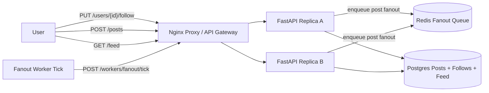

# FB News Feed

Small Docker Compose prototype for a Facebook-style news feed service.

- Nginx reverse proxy as the local load balancer/API gateway analogue
- Two stateless FastAPI replicas
- Postgres posts, follows, and precomputed feed items
- Redis queue for async fanout-on-write jobs
- Manual UI for following users, creating posts, running fanout, and paging through feed reads

Source: <https://www.hellointerview.com/learn/system-design/problem-breakdowns/fb-news-feed>

## Run

```bash
docker compose up --build
```

API docs: <http://localhost:8120/docs>

Manual UI: <http://localhost:8120/>

Runtime data is intentionally ephemeral. Postgres uses tmpfs and Redis persistence is disabled, so `docker compose down` wipes local feed data.

## Diagram



## API Examples

Follow and post:

```bash
curl -s -X PUT http://localhost:8120/users/bob/follow -H 'X-User-Id: alice'

curl -s -X POST http://localhost:8120/posts \
  -H 'content-type: application/json' \
  -H 'X-User-Id: bob' \
  -d '{"content":{"text":"hello feed"}}'
```

Run fanout and page the feed:

```bash
curl -s -X POST 'http://localhost:8120/workers/fanout/tick?limit=100'
curl -s 'http://localhost:8120/feed?page_size=5' -H 'X-User-Id: alice'
```

## Tests

Run unit tests inside an API replica:

```bash
docker compose up --build -d
docker compose exec -T api-a python -m pytest -q
```

Run the smoke test through the proxy:

```bash
python scripts/smoke_test.py
```

Or from the repo root:

```bash
make fb-news-feed-test
```

## Design Notes

- Post creation is eventually consistent for feeds: the canonical post is written immediately, then fanout work is queued.
- The worker tick materializes feed items for followers, modeling async workers consuming a real queue.
- Feed reads are fast because they query the precomputed `feed_items` table by user and timestamp cursor.
