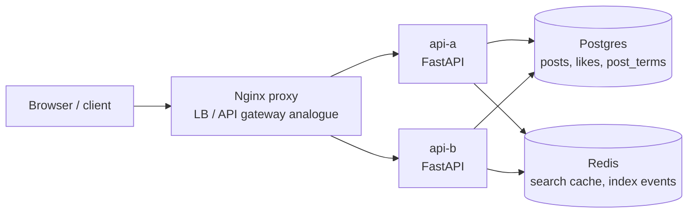

# FB Post Search Working Example

Reference: [Hello Interview FB Post Search](https://www.hellointerview.com/learn/system-design/problem-breakdowns/fb-post-search)

This prototype makes a small post-search system runnable locally. It supports post ingestion, likes, keyword search, recency ranking, like-count ranking, cacheable non-personalized queries, and multiple stateless API replicas behind Nginx as the load balancer/API gateway analogue.

## Stack

- Python, FastAPI
- Nginx proxy on `http://localhost:8180`
- Postgres for posts, likes, and the durable inverted index
- Redis for query-result cache and an index-event stream
- Docker Compose with two API replicas: `api-a` and `api-b`

All runtime state is disposable. Postgres uses tmpfs and Redis persistence is disabled, so `docker compose down` wipes data.

## Run

```bash
docker compose up --build
```

Manual UI: `http://localhost:8180`

## Diagram



## API

Create a post:

```bash
curl -s -X POST http://localhost:8180/posts \
  -H 'content-type: application/json' \
  -H 'X-User-Id: alice' \
  -d '{"content":"coffee and distributed systems"}'
```

Like a post:

```bash
curl -s -X POST http://localhost:8180/likes \
  -H 'content-type: application/json' \
  -H 'X-User-Id: bob' \
  -d '{"postId":"<post-id>"}'
```

Search by keyword:

```bash
curl -s 'http://localhost:8180/search?q=coffee&sort=recency'
curl -s 'http://localhost:8180/search?q=coffee&sort=likes'
```

Check load balancing:

```bash
curl -s http://localhost:8180/debug/instance
```

## Tests

From the repository root:

```bash
make fb-post-search-test
```

The smoke test starts the stack, verifies both replicas are reached through Nginx, loads the web UI, creates posts, likes posts idempotently, verifies cached keyword search, and checks recency and like-count sorting.

## Design Notes

- The durable search index is the `post_terms(term, post_id)` table. This keeps the demo transparent instead of hiding behavior behind a full-text engine.
- Search requires all query terms to match, then sorts by either `created_at DESC` or `like_count DESC`.
- Redis caches query results because this design intentionally excludes personalization, so repeated identical queries can share cache entries.
- Post and like writes invalidate search cache entries to keep the prototype easy to reason about. A production design could accept a short indexing delay and invalidate more selectively.
