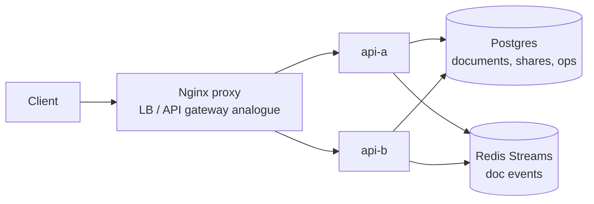

# Google Docs Working Example

Reference: [Hello Interview Google Docs](https://www.hellointerview.com/learn/system-design/problem-breakdowns/google-docs)

This prototype demonstrates document creation, sharing, versioned collaborative append operations, conflict detection, and live edit event polling through Redis streams.

## Stack

- Python, FastAPI
- Nginx proxy on `http://localhost:8230`
- Postgres for documents, shares, and operation history
- Redis streams for live document edit events
- Docker Compose with two API replicas: `api-a` and `api-b`

Runtime state is ephemeral: Postgres uses tmpfs and Redis persistence is disabled.

## Run

```bash
docker compose up --build
```

Manual UI: `http://localhost:8230`

## Diagram



## API

```bash
curl -s -X POST http://localhost:8230/documents -H 'content-type: application/json' -H 'X-User-Id: alice' -d '{"title":"Design Notes"}'
curl -s -X POST http://localhost:8230/documents/<id>/share -H 'content-type: application/json' -H 'X-User-Id: alice' -d '{"userId":"bob","permission":"write"}'
curl -s -X POST http://localhost:8230/documents/<id>/operations -H 'content-type: application/json' -H 'X-User-Id: bob' -d '{"baseVersion":0,"text":"first edit"}'
curl -s http://localhost:8230/documents/<id> -H 'X-User-Id: bob'
```

## Tests

```bash
make google-docs-test
```

The smoke test verifies UI loading, load balancing, document creation, sharing, versioned edits, read permissions, and event polling.

## Design Notes

- Each write includes a `baseVersion`; stale writers receive `409` with the current version and content.
- Postgres is the source of truth for document content and operation history.
- Redis streams model the live collaboration fanout channel. Nginx is configured with upgrade headers so a WebSocket endpoint could be added behind the same gateway shape.
