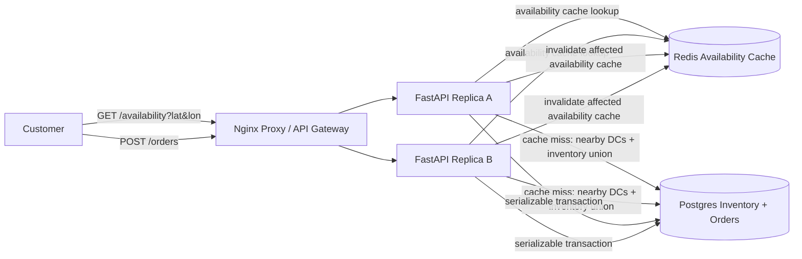

# GoPuff Local Delivery

Small Docker Compose prototype for a GoPuff-style local delivery inventory and ordering system.

- Nginx reverse proxy as the local load balancer/API gateway analogue
- Two stateless FastAPI replicas
- Postgres for distribution centers, catalog items, inventory, and orders
- Redis read-through cache for availability lookups
- Serializable Postgres order transaction to avoid double booking inventory

Source: <https://www.hellointerview.com/learn/system-design/problem-breakdowns/gopuff>

## Run

```bash
docker compose up --build
```

API docs: <http://localhost:8020/docs>

Runtime data is intentionally ephemeral. Postgres uses tmpfs and Redis persistence is disabled, so `docker compose down` wipes local state.

## Diagram



## API

Query item availability near a customer:

```bash
curl 'http://localhost:8020/availability?latitude=37.7749&longitude=-122.4194&item_id=cheetos'
```

Place an order:

```bash
curl -s -X POST http://localhost:8020/orders \
  -H 'content-type: application/json' \
  -H 'X-User-Id: alice' \
  -d '{
    "latitude": 37.7749,
    "longitude": -122.4194,
    "items": [{"item_id": "cheetos", "quantity": 2}]
  }'
```

## Try It

```bash
python scripts/smoke_test.py
```

Run unit tests inside an API replica:

```bash
docker compose exec -T api-a python -m pytest -q
```

## Design Notes

Availability is read-heavy, so the service computes the union of inventory across nearby distribution centers and caches the response with a short TTL. Orders need stronger consistency, so the prototype chooses one nearby distribution center that can fulfill every line item and updates inventory inside a single serializable Postgres transaction.
