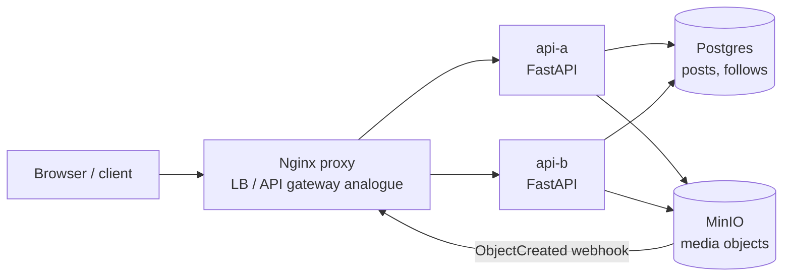

# Instagram Working Example

Reference: [Hello Interview Instagram](https://www.hellointerview.com/learn/system-design/problem-breakdowns/instagram)

This prototype demonstrates the core Instagram design: users create photo or video posts with captions, follow other users, and read a chronological feed of posts from the users they follow.

## Stack

- Python, FastAPI
- Nginx proxy on `http://localhost:8210`
- Postgres for posts and follow graph
- MinIO for photo/video object storage
- MinIO bucket notifications for asynchronous media upload confirmation
- Docker Compose with two API replicas: `api-a` and `api-b`

All runtime state is disposable. Postgres and MinIO use tmpfs-backed storage, so `docker compose down` wipes data.

## Run

```bash
docker compose up --build
```

Manual UI: `http://localhost:8210`

MinIO API: `http://localhost:8211`

MinIO console: `http://localhost:8212`

## Diagram



## API

Create a media upload slot:

```bash
curl -s -X POST http://localhost:8210/media/uploads \
  -H 'content-type: application/json' \
  -H 'X-User-Id: alice' \
  -d '{"mediaType":"photo"}'
```

Upload media with the returned `PUT` URL. MinIO sends an object-created webhook to `POST /storage/events/minio`, and the backend verifies the object with `HeadObject` before moving the post from `pending` to `uploaded`.

Check upload status:

```bash
curl -s http://localhost:8210/posts/<post-id>/upload-status \
  -H 'X-User-Id: alice'
```

Once status is `uploaded`, publish the post:

```bash
curl -s -X POST http://localhost:8210/posts \
  -H 'content-type: application/json' \
  -H 'X-User-Id: alice' \
  -d '{"postId":"<post-id>","caption":"first photo"}'
```

Follow a user:

```bash
curl -s -X POST http://localhost:8210/follows \
  -H 'content-type: application/json' \
  -H 'X-User-Id: carol' \
  -d '{"userId":"alice"}'
```

Read the chronological feed:

```bash
curl -s http://localhost:8210/feed -H 'X-User-Id: carol'
```

## Tests

From the repository root:

```bash
make instagram-test
```

The smoke test starts the stack, verifies both replicas are reached through Nginx, loads the UI, uploads media through a presigned URL, waits for MinIO's asynchronous upload notification, publishes posts, creates follows, and reads the chronological feed.

## Design Notes

- Presigned upload URLs let clients send large media directly to object storage.
- The client does not mark media uploaded. MinIO bucket notifications call the API asynchronously; the API verifies with `HeadObject` before allowing publish.
- Post metadata and the follow graph live in Postgres, while media bytes live in MinIO.
- Feed reads use a simple fanout-on-read query over the follow graph. This keeps the demo transparent; at larger scale the usual deep dive is fanout-on-write, feed caches, celebrity handling, and CDN media delivery.
- Likes, comments, stories, search, and live video are intentionally below the line for this example because the referenced core requirements focus on posts, follows, and feed reads.
