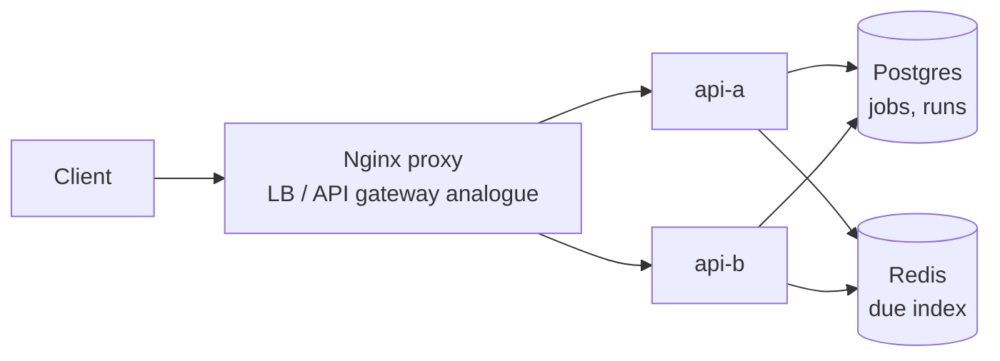

# Job Scheduler Working Example

Reference: [Hello Interview Job Scheduler](https://www.hellointerview.com/learn/system-design/problem-breakdowns/job-scheduler)

This prototype demonstrates scheduled job creation, due-job claiming, execution records, retries, and terminal failure after max attempts.

## Stack

- Python, FastAPI
- Nginx proxy on `http://localhost:8250`
- Postgres for job state and run history
- Redis sorted set as the visible due-job index
- Docker Compose with two API replicas: `api-a` and `api-b`

Runtime state is ephemeral: Postgres uses tmpfs and Redis persistence is disabled.

## Run

```bash
docker compose up --build
```

Manual UI: `http://localhost:8250`

## Diagram



## API

```bash
curl -s -X POST http://localhost:8250/jobs -H 'content-type: application/json' -d '{"name":"email","payload":{"to":"a"},"delaySeconds":0}'
curl -s -X POST http://localhost:8250/jobs/run-due
curl -s http://localhost:8250/jobs/<job-id>/runs
```

## Tests

```bash
make job-scheduler-test
```

The smoke test verifies UI loading, load balancing, job scheduling, due execution, retry behavior, terminal failure, and run history.

## Design Notes

- Postgres is the source of truth for job state.
- `FOR UPDATE SKIP LOCKED` is the important contention-control mechanism for multiple workers claiming due jobs.
- Redis provides the visible due index that would let production workers poll a small candidate set instead of scanning the database.
