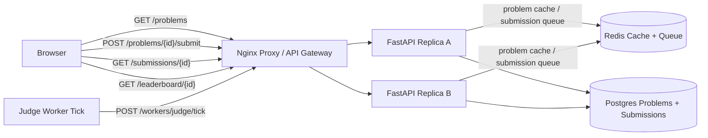

# LeetCode Judge

Small Docker Compose prototype for a LeetCode-style coding platform.

- Nginx reverse proxy as the local load balancer/API gateway analogue
- Two stateless FastAPI replicas
- Postgres problems, test cases, and submissions
- Redis problem cache and submission queue
- Explicit judge worker tick to model long-running isolated execution
- Manual UI for browsing problems, submitting code, polling results, and viewing leaderboard

Source: <https://www.hellointerview.com/learn/system-design/problem-breakdowns/leetcode>

## Run

```bash
docker compose up --build
```

API docs: <http://localhost:8140/docs>

Manual UI: <http://localhost:8140/>

Runtime data is intentionally ephemeral. Postgres uses tmpfs and Redis persistence is disabled, so `docker compose down` wipes local submissions.

## Diagram



## API Examples

Browse and submit:

```bash
curl -s http://localhost:8140/problems
curl -s http://localhost:8140/problems/two-sum

curl -s -X POST http://localhost:8140/problems/two-sum/submit \
  -H 'content-type: application/json' \
  -H 'X-User-Id: alice' \
  -d '{"language":"python","competition_id":"weekly-1","code":"def solve(nums, target):\n    return [0, 1]"}'
```

Run worker and read results:

```bash
curl -s -X POST 'http://localhost:8140/workers/judge/tick?limit=10'
curl -s http://localhost:8140/submissions/$SUBMISSION_ID
curl -s http://localhost:8140/leaderboard/weekly-1
```

## Tests

Run unit tests inside an API replica:

```bash
docker compose up --build -d
docker compose exec -T api-a python -m pytest -q
```

Run the smoke test through the proxy:

```bash
python scripts/smoke_test.py
```

Or from the repo root:

```bash
make leetcode-test
```

## Design Notes

- Submissions are queued and evaluated by a worker tick, modeling the long-running task pattern used by real judge systems.
- The toy runner is intentionally constrained and blocks obvious dangerous operations; a real system would execute code in locked-down containers with CPU, memory, filesystem, syscall, and network limits.
- Leaderboard reads rank accepted submissions by solved count and earliest last solve time.
