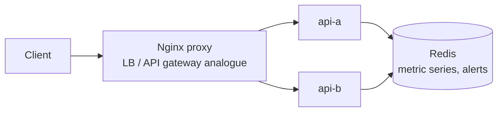

# Metrics Monitoring Working Example

Reference: [Hello Interview Metrics Monitoring](https://www.hellointerview.com/learn/system-design/problem-breakdowns/metrics-monitoring)

This prototype demonstrates metric ingestion, time-window-like series reads, alert-rule creation, and alert evaluation against the latest metric sample.

## Stack

- Python, FastAPI
- Nginx proxy on `http://localhost:8270`
- Redis sorted sets for metric samples
- Redis streams for metric and alert events
- Docker Compose with two API replicas: `api-a` and `api-b`

Redis persistence is disabled, so `docker compose down` wipes data.

## Run

```bash
docker compose up --build
```

Manual UI: `http://localhost:8270`

## Diagram



## API

```bash
curl -s -X POST http://localhost:8270/metrics -H 'content-type: application/json' -d '{"name":"cpu","value":91}'
curl -s http://localhost:8270/metrics/cpu
curl -s -X POST http://localhost:8270/alerts -H 'content-type: application/json' -d '{"name":"high cpu","metric":"cpu","threshold":80,"direction":"above"}'
curl -s -X POST http://localhost:8270/alerts/evaluate
```

## Tests

```bash
make metrics-monitoring-test
```

The smoke test verifies UI loading, load balancing, metric ingestion, series queries, alert creation, and alert evaluation.

## Design Notes

- Redis sorted sets store metric samples scored by timestamp, making range reads straightforward.
- Redis streams expose append-only metric and alert events for the local demo.
- This example keeps alert evaluation pull-based; production systems usually shard evaluators and run them continuously.
