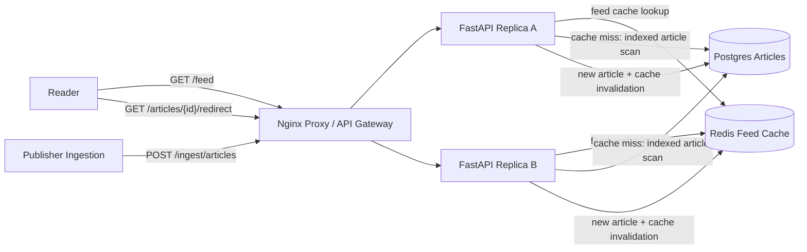

# News Aggregator

Small Docker Compose prototype for a Google News-style news aggregator.

- Nginx reverse proxy as the local load balancer/API gateway analogue
- Two stateless FastAPI replicas
- Postgres publisher/article metadata and feed indexes
- Redis cache for hot feed pages
- Cursor pagination for infinite scrolling
- Server-side redirects to publisher URLs

Source: <https://www.hellointerview.com/learn/system-design/problem-breakdowns/google-news>

## Run

```bash
docker compose up --build
```

API docs: <http://localhost:8060/docs>

Runtime data is intentionally ephemeral. Postgres uses tmpfs and Redis persistence is disabled, so `docker compose down` wipes local article data.

## Diagram



## API

Fetch the feed:

```bash
curl -s 'http://localhost:8060/feed?limit=2'
```

Fetch the next page using `nextCursor`:

```bash
curl -s 'http://localhost:8060/feed?limit=2&cursor=<nextCursor>'
```

Ingest an article:

```bash
curl -s -X POST http://localhost:8060/ingest/articles \
  -H 'content-type: application/json' \
  -d '{
    "publisher_id": "tech-wire",
    "title": "Breaking Cache News",
    "summary": "A new cache invalidation story.",
    "category": "technology",
    "publisher_url": "https://publisher.example/cache"
  }'
```

Redirect to a publisher:

```bash
curl -i http://localhost:8060/articles/{article_id}/redirect
```

## Try It

```bash
python scripts/smoke_test.py
```

Run unit tests inside an API replica:

```bash
docker compose exec -T api-a python -m pytest -q
```

## Design Notes

The prototype models the read-heavy path by caching feed pages and serving cursor-based pagination over an indexed article table. Publisher ingestion writes articles and invalidates cached feed pages so new content appears quickly, while the user click path performs a server-side redirect to the publisher URL.
