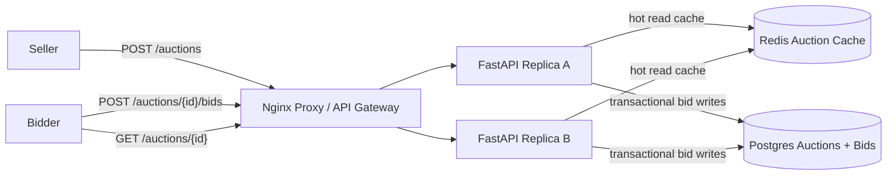

# Online Auction

Small Docker Compose prototype for an eBay-style auction service.

- Nginx reverse proxy as the local load balancer/API gateway analogue
- Two stateless FastAPI replicas
- Postgres auctions and bids with `SELECT ... FOR UPDATE` bid contention control
- Redis cache for hot auction views and a short recent-bid event list
- Manual UI for posting auctions, bidding, and viewing current highest bid

Source: <https://www.hellointerview.com/learn/system-design/problem-breakdowns/online-auction>

## Run

```bash
docker compose up --build
```

API docs: <http://localhost:8090/docs>

Manual UI: <http://localhost:8090/>

Runtime data is intentionally ephemeral. Postgres uses tmpfs and Redis persistence is disabled, so `docker compose down` wipes local auction data.

## Diagram



## API Examples

Create an auction:

```bash
curl -s -X POST http://localhost:8090/auctions \
  -H 'content-type: application/json' \
  -H 'X-User-Id: alice' \
  -d '{"title":"Vintage keyboard","description":"Clicky local demo hardware.","starting_price":"50.00","ends_at":"2026-05-08T10:00:00Z"}'
```

Bid and view:

```bash
curl -s -X POST http://localhost:8090/auctions/$AUCTION_ID/bids \
  -H 'content-type: application/json' \
  -H 'X-User-Id: bob' \
  -d '{"amount":"75.00"}'

curl -s http://localhost:8090/auctions/$AUCTION_ID
```

## Tests

Run unit tests inside an API replica:

```bash
docker compose up --build -d
docker compose exec -T api-a python -m pytest -q
```

Run the smoke test through the proxy:

```bash
python scripts/smoke_test.py
```

Or from the repo root:

```bash
make online-auction-test
```

## Design Notes

- Bid writes lock the auction row in Postgres, compare the new amount against the current highest bid, and update the winner in the same serializable transaction.
- Auction reads use a Redis read-through cache because the view path is much hotter than the write path.
- Accepted bids invalidate the auction cache and append a small event payload to Redis, modeling the real-time bid update stream in the full design.
