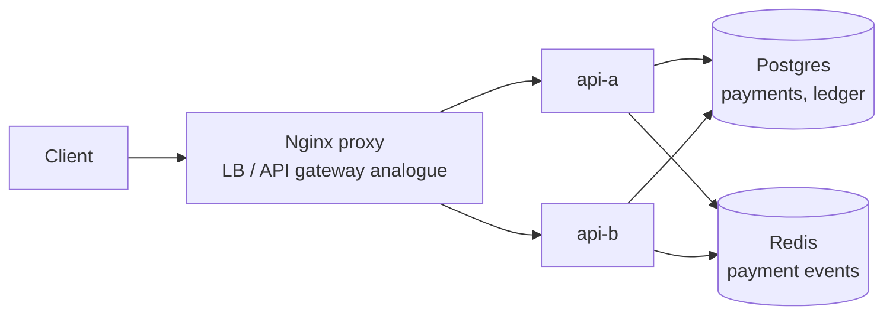

# Payment System Working Example

Reference: [Hello Interview Payment System](https://www.hellointerview.com/learn/system-design/problem-breakdowns/payment-system)

This prototype demonstrates payment-method token storage, idempotent payment capture, double-entry ledger records, replay detection, and refunds.

## Stack

- Python, FastAPI
- Nginx proxy on `http://localhost:8260`
- Postgres for payment methods, payments, and ledger entries
- Redis stream for payment events
- Docker Compose with two API replicas: `api-a` and `api-b`

Runtime state is ephemeral: Postgres uses tmpfs and Redis persistence is disabled.

## Run

```bash
docker compose up --build
```

Manual UI: `http://localhost:8260`

## Diagram



## API

```bash
curl -s -X POST http://localhost:8260/payment-methods -H 'content-type: application/json' -d '{"userId":"alice","token":"tok_demo","brand":"visa","last4":"4242"}'
curl -s -X POST http://localhost:8260/payments -H 'content-type: application/json' -H 'Idempotency-Key: idem-1' -d '{"userId":"alice","merchantId":"store-1","amountCents":1299,"currency":"USD"}'
curl -s http://localhost:8260/payments/<payment-id>/ledger
curl -s -X POST http://localhost:8260/payments/<payment-id>/refund
```

## Tests

```bash
make payment-system-test
```

The smoke test verifies UI loading, load balancing, payment-method creation, idempotent capture replay, balanced ledger entries, and refunds.

## Design Notes

- `Idempotency-Key` prevents duplicate charges from client retries.
- Ledger entries are balanced in integer cents, making money movement inspectable.
- Refunds append reversing ledger entries rather than deleting historical records.
