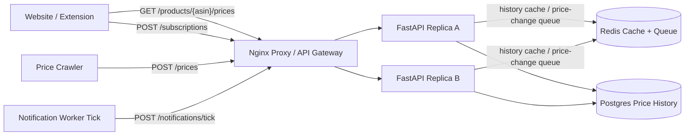

# Price Tracking Service

Small Docker Compose prototype for a CamelCamelCamel-style price tracking service.

- Nginx reverse proxy as the local load balancer/API gateway analogue
- Two stateless FastAPI replicas
- Postgres product, price history, subscription, and notification tables
- Redis read-through cache for price history and a queue for price-change notification work
- Manual UI for ingesting prices, subscribing to thresholds, and checking notifications

Source: <https://www.hellointerview.com/learn/system-design/problem-breakdowns/camelcamelcamel>

## Run

```bash
docker compose up --build
```

API docs: <http://localhost:8100/docs>

Manual UI: <http://localhost:8100/>

Runtime data is intentionally ephemeral. Postgres uses tmpfs and Redis persistence is disabled, so `docker compose down` wipes local price data.

## Diagram



## API Examples

Ingest a product price:

```bash
curl -s -X POST http://localhost:8100/prices \
  -H 'content-type: application/json' \
  -d '{"asin":"B000DEMO","title":"Demo headphones","price":"89.99","source":"crawler"}'
```

Read price history and subscribe:

```bash
curl -s http://localhost:8100/products/B000DEMO/prices

curl -s -X POST http://localhost:8100/subscriptions \
  -H 'content-type: application/json' \
  -H 'X-User-Id: alice' \
  -d '{"asin":"B000DEMO","threshold_price":"100.00"}'
```

Process and view notifications:

```bash
curl -s -X POST http://localhost:8100/notifications/tick
curl -s http://localhost:8100/notifications -H 'X-User-Id: alice'
```

## Tests

Run unit tests inside an API replica:

```bash
docker compose up --build -d
docker compose exec -T api-a python -m pytest -q
```

Run the smoke test through the proxy:

```bash
python scripts/smoke_test.py
```

Or from the repo root:

```bash
make price-tracking-test
```

## Design Notes

- Price history reads are cached because chart requests are hot and eventual consistency is acceptable.
- Price ingestion appends a small event into Redis; the notification worker tick checks active subscriptions and writes durable notification rows.
- The explicit worker endpoint keeps the prototype easy to inspect while modeling the async processing path in the full design.
