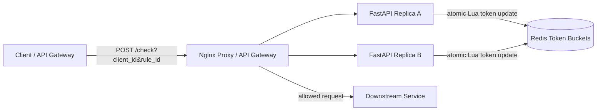

# Distributed Rate Limiter

Small Docker Compose prototype for a distributed request-level rate limiter.

- Nginx reverse proxy as the local load balancer/API gateway analogue
- Two stateless FastAPI replicas
- Redis shared token-bucket state, so both replicas enforce one quota
- Per-rule configuration and fallback default rule
- Manual UI for creating rules and issuing request bursts

Source: <https://www.hellointerview.com/learn/system-design/problem-breakdowns/distributed-rate-limiter>

## Run

```bash
docker compose up --build
```

API docs: <http://localhost:8160/docs>

Manual UI: <http://localhost:8160/>

Runtime data is intentionally ephemeral. Redis persistence is disabled, so `docker compose down` wipes local counters and rules.

## Diagram



## API Examples

Create a rule:

```bash
curl -s -X POST http://localhost:8160/rules \
  -H 'content-type: application/json' \
  -d '{"rule_id":"search","capacity":3,"refill_per_second":1}'
```

Check a request:

```bash
curl -s -X POST 'http://localhost:8160/check?client_id=alice&rule_id=search'
```

## Tests

Run unit tests inside an API replica:

```bash
docker compose up --build -d
docker compose exec -T api-a python -m pytest -q
```

Run the smoke test through the proxy:

```bash
python scripts/smoke_test.py
```

Or from the repo root:

```bash
make rate-limiter-test
```

## Design Notes

- The Redis Lua script makes each token bucket check atomic across API replicas.
- Unknown rule IDs fall back to the default rule instead of failing open or closed unexpectedly.
- A production version would shard Redis by client/rule key and decide explicit behavior for Redis outages.
