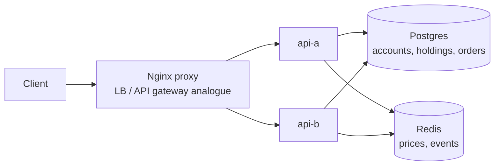

# Robinhood Working Example

Reference: [Hello Interview Robinhood](https://www.hellointerview.com/learn/system-design/problem-breakdowns/robinhood)

This prototype demonstrates market price ingestion, buy/sell order placement, portfolio updates, insufficient-funds/share rejection, and a small market/order event stream.

## Stack

- Python, FastAPI
- Nginx proxy on `http://localhost:8220`
- Postgres for accounts, holdings, and orders
- Redis for latest market prices and event streams
- Docker Compose with two API replicas: `api-a` and `api-b`

Runtime state is ephemeral: Postgres uses tmpfs and Redis persistence is disabled.

## Run

```bash
docker compose up --build
```

Manual UI: `http://localhost:8220`

## Diagram



## API

```bash
curl -s -X POST http://localhost:8220/market/prices -H 'content-type: application/json' -d '{"symbol":"AAPL","priceCents":18000}'
curl -s -X POST http://localhost:8220/orders -H 'content-type: application/json' -d '{"userId":"alice","symbol":"AAPL","side":"buy","quantity":1}'
curl -s http://localhost:8220/portfolio/alice
```

## Tests

```bash
make robinhood-test
```

The smoke test verifies UI loading, load balancing across both replicas, price updates, filled buy/sell orders, rejected orders, and portfolio reads.

## Design Notes

- Integer cents avoid floating-point money errors.
- Account and holding rows are locked inside the order transaction to keep cash/share updates consistent.
- Redis holds low-latency latest prices and append-only demo event streams, while Postgres remains the source of truth for orders and balances.
