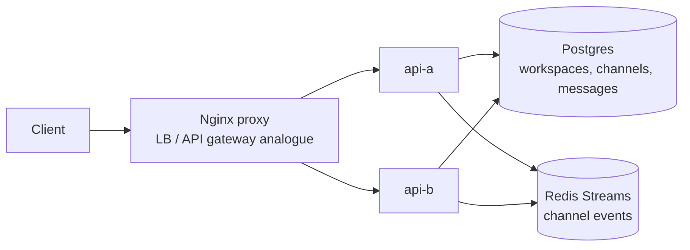

# Slack Working Example

Reference: [Tech Interview: Design Slack](https://www.techinterview.org/post/3233474302/system-design-design-slack-enterprise-messaging-channels-threads-real-time-search-file-sharing-presence-workspace/)

This prototype demonstrates a compact Slack-style enterprise messaging system: multi-tenant workspaces, channels, channel membership, message history, thread replies, full-text message search, and live channel events.

## Stack

- Python, FastAPI
- Nginx proxy on `http://localhost:8280`
- Postgres for workspaces, channels, memberships, and durable messages
- Redis streams for channel event fanout
- Docker Compose with two API replicas: `api-a` and `api-b`

Runtime state is ephemeral: Postgres uses tmpfs and Redis persistence is disabled.

## Run

```bash
docker compose up --build
```

Manual UI: `http://localhost:8280`

## Diagram



## API

```bash
curl -s -X POST http://localhost:8280/workspaces -H 'content-type: application/json' -H 'X-User-Id: alice' -d '{"name":"Acme","members":["alice","bob"]}'
curl -s -X POST http://localhost:8280/channels -H 'content-type: application/json' -H 'X-User-Id: alice' -d '{"workspaceId":"<workspace-id>","name":"engineering","members":["alice","bob"]}'
curl -s -X POST http://localhost:8280/channels/<channel-id>/messages -H 'content-type: application/json' -H 'X-User-Id: bob' -d '{"body":"deploy plan is ready"}'
curl -s 'http://localhost:8280/search?workspace_id=<workspace-id>&q=deploy' -H 'X-User-Id: bob'
```

## Tests

```bash
make slack-test
```

The smoke test verifies UI loading, load balancing, workspace creation, channel creation, message posting, thread replies, search visibility, and Redis-backed live event polling.

## Design Notes

- Workspace and channel IDs scope all message access, matching the multi-tenant shape of Slack-like systems.
- Postgres is the durable source of truth and uses a GIN full-text index for local search.
- Redis streams model the real-time channel fanout path across stateless API replicas.
- Nginx includes upgrade headers so the same gateway can support WebSocket delivery as the example evolves.
