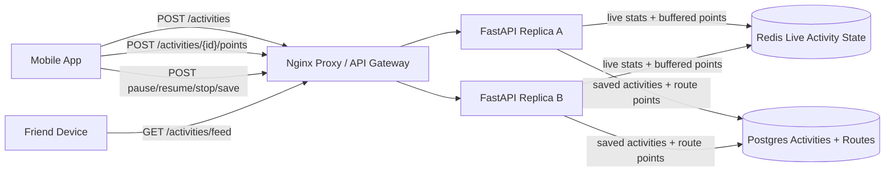

# Strava Activity Tracking

Small Docker Compose prototype for a Strava-style fitness activity service.

- Nginx reverse proxy as the local load balancer/API gateway analogue
- Two stateless FastAPI replicas
- Redis for live in-progress activity state and route-point buffering
- Postgres for saved activities, durable route points, and friend visibility
- Activity lifecycle endpoints for start, pause, resume, stop, and save
- Friend feed reads for completed activities

Source: <https://www.hellointerview.com/learn/system-design/problem-breakdowns/strava>

## Run

```bash
docker compose up --build
```

API docs: <http://localhost:8080/docs>

Manual UI: <http://localhost:8080/>

Runtime data is intentionally ephemeral. Postgres uses tmpfs and Redis persistence is disabled, so `docker compose down` wipes local activity data.

## Diagram



## API Examples

Start an activity:

```bash
curl -s -X POST http://localhost:8080/activities \
  -H 'content-type: application/json' \
  -H 'X-User-Id: alice' \
  -d '{"activity_type":"run"}'
```

Upload local or offline-buffered points:

```bash
curl -s -X POST http://localhost:8080/activities/$ACTIVITY_ID/points \
  -H 'content-type: application/json' \
  -H 'X-User-Id: alice' \
  -d '{"points":[{"latitude":37.7749,"longitude":-122.4194},{"latitude":37.7759,"longitude":-122.4184}]}'
```

Pause, resume, stop, then save:

```bash
curl -s -X POST http://localhost:8080/activities/$ACTIVITY_ID/pause -H 'X-User-Id: alice'
curl -s -X POST http://localhost:8080/activities/$ACTIVITY_ID/resume -H 'X-User-Id: alice'
curl -s -X POST http://localhost:8080/activities/$ACTIVITY_ID/stop -H 'X-User-Id: alice'
curl -s -X POST http://localhost:8080/activities/$ACTIVITY_ID/save -H 'X-User-Id: alice'
```

Read activity details and a friend feed:

```bash
curl -s http://localhost:8080/activities/$ACTIVITY_ID -H 'X-User-Id: bob'
curl -s http://localhost:8080/activities/feed -H 'X-User-Id: bob'
```

## Tests

Run unit tests inside an API replica:

```bash
docker compose up --build -d
docker compose exec -T api-a python -m pytest -q
```

Run the smoke test through the proxy:

```bash
python scripts/smoke_test.py
```

Or from the repo root:

```bash
make strava-test
```

## Design Notes

- In-progress activity state is kept in Redis so either API replica can read and update live stats.
- The point upload endpoint accepts batches, which models mobile clients queueing GPS points while offline and replaying them later.
- Saving moves the completed activity and route points into Postgres and deletes the live Redis keys.
- Friend access is modeled with a `friendships` table so Bob can read Alice's saved activity while unrelated users cannot.
