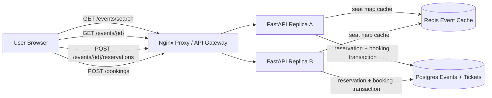

# Ticketmaster Booking

Small Docker Compose prototype for a Ticketmaster-style event search and ticket booking service.

- Nginx reverse proxy as the local load balancer/API gateway analogue
- Two stateless FastAPI replicas
- Postgres event, venue, performer, ticket, reservation, and booking tables
- Redis read-through cache for event seat maps
- Short transactional reservation flow to avoid double booking seats
- Manual UI for search, event viewing, reservation, and booking confirmation

Source: <https://www.hellointerview.com/learn/system-design/problem-breakdowns/ticketmaster>

## Run

```bash
docker compose up --build
```

API docs: <http://localhost:8110/docs>

Manual UI: <http://localhost:8110/>

Runtime data is intentionally ephemeral. Postgres uses tmpfs and Redis persistence is disabled, so `docker compose down` wipes local ticket data.

## Diagram



## API Examples

Search and view an event:

```bash
curl -s 'http://localhost:8110/events/search?q=jazz&city=San%20Francisco'
curl -s http://localhost:8110/events/evt-jazz
```

Reserve seats and confirm:

```bash
curl -s -X POST http://localhost:8110/events/evt-jazz/reservations \
  -H 'content-type: application/json' \
  -H 'X-User-Id: alice' \
  -d '{"ticket_ids":["t-jazz-a1","t-jazz-a2"]}'

curl -s -X POST http://localhost:8110/bookings \
  -H 'content-type: application/json' \
  -H 'X-User-Id: alice' \
  -d '{"reservation_id":"'$RESERVATION_ID'"}'
```

## Tests

Run unit tests inside an API replica:

```bash
docker compose up --build -d
docker compose exec -T api-a python -m pytest -q
```

Run the smoke test through the proxy:

```bash
python scripts/smoke_test.py
```

Or from the repo root:

```bash
make ticketmaster-test
```

## Design Notes

- Event search and seat-map reads are optimized for availability and read throughput with a short Redis cache.
- Booking consistency is enforced by a short serializable transaction that locks selected ticket rows only while changing their status.
- Reserved seats include an expiration timestamp. A ticket is claimable when it is `available`, or when a previous `reserved` hold has expired.
