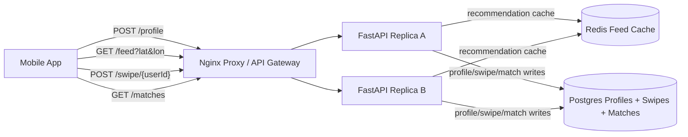

# Tinder Matching

Small Docker Compose prototype for a Tinder-style dating recommendation and swipe service.

- Nginx reverse proxy as the local load balancer/API gateway analogue
- Two stateless FastAPI replicas
- Postgres profiles, swipes, and mutual matches
- Redis cache for short-lived recommendation stacks
- Serializable swipe transaction for strong mutual-match creation
- Manual UI for saving profiles, loading recommendations, swiping, and viewing matches

Source: <https://www.hellointerview.com/learn/system-design/problem-breakdowns/tinder>

## Run

```bash
docker compose up --build
```

API docs: <http://localhost:8130/docs>

Manual UI: <http://localhost:8130/>

Runtime data is intentionally ephemeral. Postgres uses tmpfs and Redis persistence is disabled, so `docker compose down` wipes local matching data.

## Diagram



## API Examples

Save a profile and load recommendations:

```bash
curl -s -X POST http://localhost:8130/profile \
  -H 'content-type: application/json' \
  -H 'X-User-Id: alice' \
  -d '{"name":"Alice","age":29,"gender":"female","interested_in":"male","min_age":24,"max_age":38,"max_distance_km":15,"latitude":37.7749,"longitude":-122.4194}'

curl -s 'http://localhost:8130/feed?latitude=37.7749&longitude=-122.4194' -H 'X-User-Id: alice'
```

Swipe and check matches:

```bash
curl -s -X POST http://localhost:8130/swipe/bob \
  -H 'content-type: application/json' \
  -H 'X-User-Id: alice' \
  -d '{"decision":"yes"}'

curl -s http://localhost:8130/matches -H 'X-User-Id: alice'
```

## Tests

Run unit tests inside an API replica:

```bash
docker compose up --build -d
docker compose exec -T api-a python -m pytest -q
```

Run the smoke test through the proxy:

```bash
python scripts/smoke_test.py
```

Or from the repo root:

```bash
make tinder-test
```

## Design Notes

- The feed avoids showing previously swiped profiles by anti-joining against the swipe table.
- Recommendation stack reads are cached briefly because location and preferences do not need strict consistency.
- Swipe writes use a serializable transaction and canonical sorted user pair for matches, so mutual right swipes produce exactly one match.
