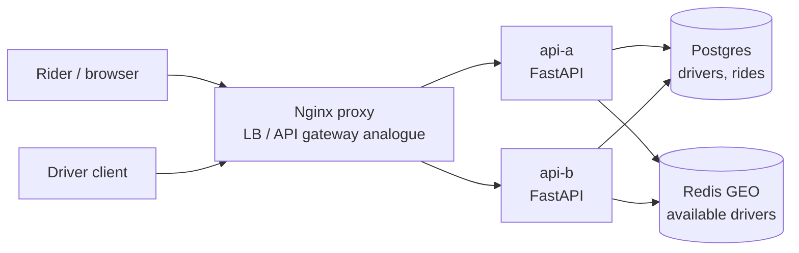

# Uber Working Example

Reference: [Hello Interview Uber](https://www.hellointerview.com/learn/system-design/problem-breakdowns/uber)

This prototype demonstrates a small ride-sharing backend: drivers publish availability, riders get fare estimates, riders request rides, nearby available drivers are matched, drivers accept or decline, and rides complete.

## Stack

- Python, FastAPI
- Nginx proxy on `http://localhost:8200`
- Postgres for durable driver and ride state
- Redis geospatial index for nearby available-driver lookup
- Docker Compose with two API replicas: `api-a` and `api-b`

All runtime state is disposable. Postgres uses tmpfs and Redis persistence is disabled, so `docker compose down` wipes data.

## Run

```bash
docker compose up --build
```

Manual UI: `http://localhost:8200`

## Diagram



## API

Publish driver location:

```bash
curl -s -X POST http://localhost:8200/drivers/driver-1/location \
  -H 'content-type: application/json' \
  -d '{"lat":37.7750,"lng":-122.4195,"available":true}'
```

Estimate fare:

```bash
curl -s 'http://localhost:8200/fare-estimate?startLat=37.7749&startLng=-122.4194&destLat=37.8044&destLng=-122.2712'
```

Request a ride:

```bash
curl -s -X POST http://localhost:8200/rides \
  -H 'content-type: application/json' \
  -d '{"riderId":"rider-1","startLat":37.7749,"startLng":-122.4194,"destLat":37.8044,"destLng":-122.2712}'
```

Driver response:

```bash
curl -s -X POST http://localhost:8200/rides/<ride-id>/respond \
  -H 'content-type: application/json' \
  -d '{"driverId":"driver-1","accept":true}'
```

Complete a ride:

```bash
curl -s -X POST http://localhost:8200/rides/<ride-id>/complete
```

## Tests

From the repository root:

```bash
make uber-test
```

The smoke test starts the stack, verifies both replicas are reached through Nginx, loads the UI, creates available drivers, estimates a fare, assigns the nearest available driver, proves a second ride does not reuse the requested driver, and completes the ride lifecycle.

## Design Notes

- Redis GEO keeps nearby available-driver search low latency.
- Postgres row locks on candidate drivers provide the strong consistency point that prevents double assignment.
- Drivers are removed from the Redis availability index as soon as they are requested, then re-added when they decline or complete a ride.
- This local prototype performs assignment synchronously. A production design could split matching into a queue-backed workflow with driver push notifications and timeout handling.
