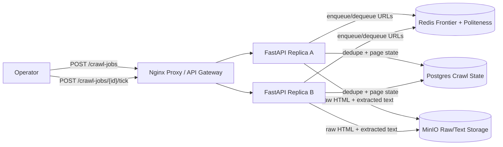

# Web Crawler

Small Docker Compose prototype for a web crawler pipeline.

- Nginx reverse proxy as the local load balancer/API gateway analogue
- Two stateless FastAPI replicas
- Redis frontier queue and host politeness keys
- Postgres crawl job/page state and URL dedupe
- MinIO as local S3-compatible storage for raw HTML and extracted text
- Deterministic fixture web so tests do not depend on live internet

Source: <https://www.hellointerview.com/learn/system-design/problem-breakdowns/web-crawler>

## Run

```bash
docker compose up --build
```

API docs: <http://localhost:8040/docs>

Manual UI: <http://localhost:8040/>

MinIO console: <http://localhost:9022>

Credentials:

```text
minioadmin / minioadmin
```

Runtime data is intentionally ephemeral. Postgres and MinIO use tmpfs-backed data paths, and Redis persistence is disabled, so `docker compose down` wipes local crawl state.

## Diagram



## API

Create a crawl job:

```bash
curl -s -X POST http://localhost:8040/crawl-jobs \
  -H 'content-type: application/json' \
  -d '{"seeds":["https://example.test/"],"max_pages":4}'
```

Process queued URLs:

```bash
curl -s -X POST 'http://localhost:8040/crawl-jobs/{job_id}/tick?limit=4'
```

Inspect progress:

```bash
curl -s http://localhost:8040/crawl-jobs/{job_id}
```

## Try It

```bash
python scripts/smoke_test.py
```

Run unit tests inside an API replica:

```bash
docker compose exec -T api-a python -m pytest -q
```

## Design Notes

The prototype models the crawler as a frontier queue plus shared crawl state. Redis handles fast queue operations and host politeness locks. Postgres enforces per-job URL uniqueness and tracks crawl state. Raw HTML and extracted text are stored separately in blob storage, matching the common large-object pattern used for crawler pipelines.
