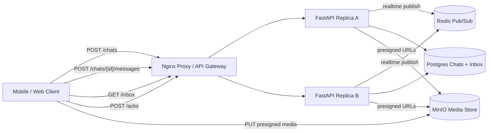

# WhatsApp Messaging

Small Docker Compose prototype for a WhatsApp-style messaging service.

- Nginx reverse proxy as the local load balancer/API gateway analogue
- Two stateless FastAPI replicas
- Postgres chats, participants, messages, durable inboxes, and attachment metadata
- Redis pub/sub hook for realtime fanout modeling
- MinIO presigned upload/download URLs for media
- Manual UI for creating chats, sending messages, uploading media, reading inboxes, and acking delivery

Source: <https://www.hellointerview.com/learn/system-design/problem-breakdowns/whatsapp>

## Run

```bash
docker compose up --build
```

API docs: <http://localhost:8150/docs>

Manual UI: <http://localhost:8150/>

MinIO console: <http://localhost:8152>

Credentials:

```text
minioadmin / minioadmin
```

Runtime data is intentionally ephemeral. Postgres and MinIO use tmpfs-backed data paths, and Redis persistence is disabled, so `docker compose down` wipes local chat data and media.

## Diagram



## API Examples

Create a chat:

```bash
curl -s -X POST http://localhost:8150/chats \
  -H 'content-type: application/json' \
  -H 'X-User-Id: alice' \
  -d '{"participants":["bob","charlie"],"name":"demo"}'
```

Create media upload target and send a message:

```bash
curl -s -X POST http://localhost:8150/attachments \
  -H 'content-type: application/json' \
  -H 'X-User-Id: alice' \
  -d '{"filename":"note.txt","mime_type":"text/plain"}'

curl -s -X POST http://localhost:8150/chats/$CHAT_ID/messages \
  -H 'content-type: application/json' \
  -H 'X-User-Id: alice' \
  -d '{"body":"hello","attachment_ids":["'$ATTACHMENT_ID'"]}'
```

Read and ack offline messages:

```bash
curl -s http://localhost:8150/inbox -H 'X-User-Id: bob'

curl -s -X POST http://localhost:8150/acks \
  -H 'content-type: application/json' \
  -H 'X-User-Id: bob' \
  -d '{"message_id":"'$MESSAGE_ID'"}'
```

## Tests

Run unit tests inside an API replica:

```bash
docker compose up --build -d
docker compose exec -T api-a python -m pytest -q
```

Run the smoke test through the proxy:

```bash
python scripts/smoke_test.py
```

Or from the repo root:

```bash
make whatsapp-test
```

## Design Notes

- Sending a message writes the canonical message once and writes one inbox row per participant. Inbox rows model durable offline delivery for up to a TTL window in a real system.
- Acknowledgement deletes the recipient's inbox row, which makes delivery idempotent and inspectable.
- Media is uploaded directly to object storage with presigned URLs; messages only reference attachment metadata.
