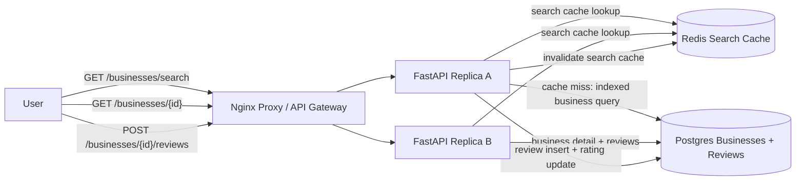

# Yelp Business Search

Small Docker Compose prototype for a Yelp-style local business review service.

- Nginx reverse proxy as the local load balancer/API gateway analogue
- Two stateless FastAPI replicas
- Postgres business and review data
- Redis cache for hot business searches
- Search by name, category, and distance from latitude/longitude
- One review per user per business
- Average rating maintained on writes for fast search/detail reads

Source: <https://www.hellointerview.com/learn/system-design/problem-breakdowns/yelp>

## Run

```bash
docker compose up --build
```

API docs: <http://localhost:8070/docs>

Runtime data is intentionally ephemeral. Postgres uses tmpfs and Redis persistence is disabled, so `docker compose down` wipes local business/review data.

## Diagram



## API

Search businesses:

```bash
curl -s 'http://localhost:8070/businesses/search?q=tacos&category=restaurants&latitude=37.7749&longitude=-122.4194&radius_km=5'
```

View business details and reviews:

```bash
curl -s http://localhost:8070/businesses/biz-1
```

Leave a review:

```bash
curl -s -X POST http://localhost:8070/businesses/biz-1/reviews \
  -H 'content-type: application/json' \
  -H 'X-User-Id: dave' \
  -d '{"rating":3,"text":"Solid lunch."}'
```

## Try It

```bash
python scripts/smoke_test.py
```

Run unit tests inside an API replica:

```bash
docker compose exec -T api-a python -m pytest -q
```

## Design Notes

Search is the read-heavy path, so the prototype caches search responses and keeps average rating denormalized on the business row. Review writes are less frequent but require consistency: the database enforces one review per user per business and updates the review count/average rating in the same transaction.
