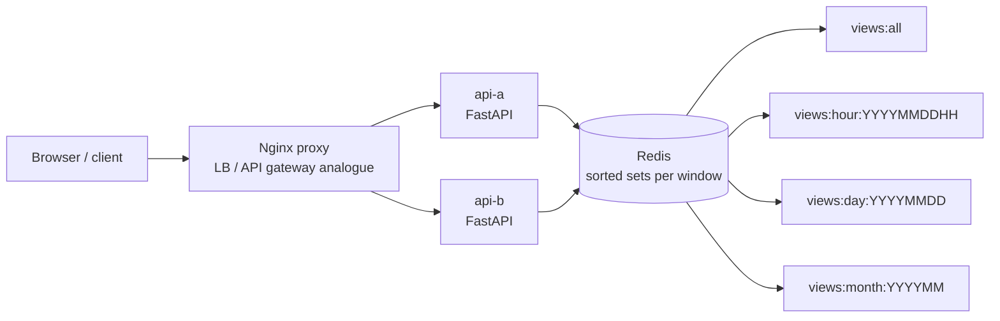

# YouTube Top K Working Example

Reference: [Hello Interview YouTube Top K](https://www.hellointerview.com/learn/system-design/problem-breakdowns/top-k)

This prototype demonstrates exact Top K video-view aggregation for all-time and tumbling hour, day, and month windows. It uses two stateless FastAPI replicas behind Nginx, with Redis sorted sets as the shared aggregation layer.

## Stack

- Python, FastAPI
- Nginx proxy on `http://localhost:8190`
- Redis sorted sets for per-window view counters
- Redis stream for a small visible view-event firehose
- Docker Compose with two API replicas: `api-a` and `api-b`

Redis persistence is disabled, so `docker compose down` wipes runtime data.

## Run

```bash
docker compose up --build
```

Manual UI: `http://localhost:8190`

## Diagram



## API

Record one view event:

```bash
curl -s -X POST http://localhost:8190/views \
  -H 'content-type: application/json' \
  -d '{"videoId":"video-a","count":1,"viewedAt":"2026-05-07T13:45:00Z"}'
```

Record a batch:

```bash
curl -s -X POST http://localhost:8190/views/batch \
  -H 'content-type: application/json' \
  -d '{"views":[{"videoId":"video-a","count":10},{"videoId":"video-b","count":7}]}'
```

Query Top K:

```bash
curl -s 'http://localhost:8190/views/top-k?window=all&k=10'
curl -s 'http://localhost:8190/views/top-k?window=hour&k=10&at=2026-05-07T13%3A45%3A00Z'
```

Supported windows are `all`, `hour`, `day`, and `month`.

## Tests

From the repository root:

```bash
make youtube-top-k-test
```

The smoke test starts the stack, verifies both replicas are reached through Nginx, loads the UI, ingests view batches, and checks exact Top K results across all windows.

## Design Notes

- `ZINCRBY` updates Redis sorted sets for `views:all` plus the current hour, day, and month buckets.
- `ZREVRANGE WITHSCORES` reads the top videos in rank order, matching the Top K API shape.
- Tumbling window keys include the truncated timestamp. Short TTLs on bounded windows model old-window cleanup.
- The local demo is exact. At larger scale, this is where the design discussion can branch into sharded counters, periodic merge jobs, heavy-hitter sketches, and cached Top K materializations.
