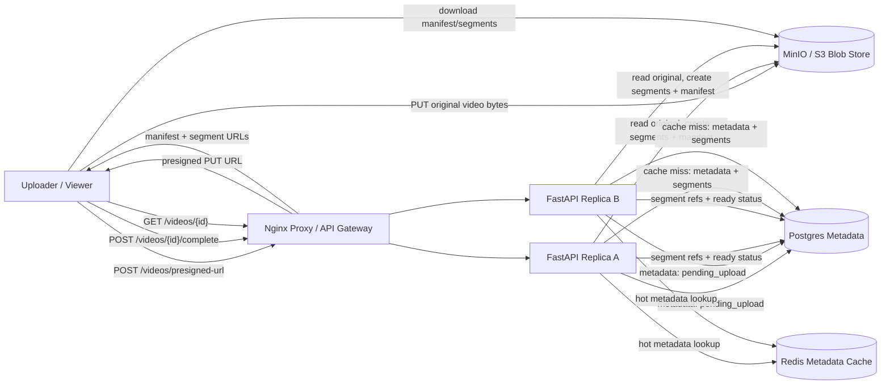

# YouTube Video Streaming

Small Docker Compose prototype for a YouTube-style video upload and streaming system.

- Nginx reverse proxy as the local load balancer/API gateway analogue
- Two stateless FastAPI replicas
- Postgres for video metadata, upload parts, and segment references
- MinIO as local S3-compatible blob storage
- Redis cache for hot video metadata
- Presigned upload URLs so large video bytes bypass the API server
- Simulated processing into multi-rendition streamable segments and a manifest file
- Multipart upload state for resumable uploads

Source: <https://www.hellointerview.com/learn/system-design/problem-breakdowns/youtube>

## Run

```bash
docker compose up --build
```

API docs: <http://localhost:8030/docs>

Manual UI: <http://localhost:8030/>

MinIO console: <http://localhost:9012>

Credentials:

```text
minioadmin / minioadmin
```

Runtime data is intentionally ephemeral. Postgres and MinIO use tmpfs-backed data paths, and Redis persistence is disabled, so `docker compose down` wipes local metadata and videos.

## Diagram



## API

Create a presigned upload:

```bash
curl -s -X POST http://localhost:8030/videos/presigned-url \
  -H 'content-type: application/json' \
  -H 'X-User-Id: alice' \
  -d '{
    "video_metadata": {
      "title": "System Design Walkthrough",
      "description": "A local demo video",
      "size": 4096
    }
  }'
```

After uploading bytes to the returned URL, mark the upload complete and process segments:

```bash
curl -s -X POST http://localhost:8030/videos/{video_id}/complete
```

Fetch playback metadata:

```bash
curl -s http://localhost:8030/videos/{video_id}
```

Create a resumable multipart upload:

```bash
curl -s -X POST http://localhost:8030/videos/multipart/presigned-url \
  -H 'content-type: application/json' \
  -H 'X-User-Id: alice' \
  -d '{
    "video_metadata": {
      "title": "Large Upload",
      "description": "Multipart demo",
      "size": 10485760
    },
    "chunk_size": 5242880
  }'
```

## Try It

```bash
python scripts/smoke_test.py
```

Run unit tests inside an API replica:

```bash
docker compose exec -T api-a python -m pytest -q
```

## Design Notes

This prototype mirrors the core YouTube design: upload large blobs directly to object storage, store metadata separately, process uploaded videos into streamable segments and a manifest, cache hot metadata, and return manifest/segment URLs so clients can stream incrementally.
